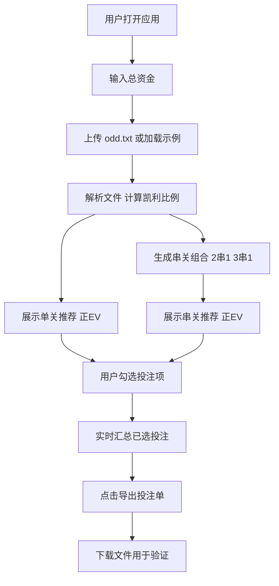

## 1. 产品概述

凯利投注计算器是一款基于凯利公式（Kelly Criterion）的足球赛事投注分析工具。它读取本地赔率数据文件，自动计算每个投注选项的最优投注比例与金额，并支持单关与串关推荐、勾选筛选、导出投注单用于事后验证。

- **目标用户**：有一定数学基础的足球竞彩爱好者，希望用资金管理策略进行理性投注
- **核心价值**：把"凭感觉下注"升级为"按期望价值与凯利比例量化下注"，并提供可追溯的投注记录用于复盘

## 2. 核心功能

### 2.1 功能模块
1. **主页面（单页应用）**：资金输入、文件上传、比赛数据展示、凯利计算结果、单关推荐、串关推荐、勾选与导出

### 2.2 页面详情
| 页面名称 | 模块名称 | 功能描述 |
|----------|----------|----------|
| 主页面 | 顶部控制栏 | 总资金输入、上传 odd.txt 文件按钮、加载示例数据按钮、导出投注单按钮 |
| 主页面 | 比赛数据卡片 | 展示每场比赛的联赛、队伍、时间、胜平负/比分/总进球的概率与赔率 |
| 主页面 | 凯利计算结果表 | 对每个投注选项计算凯利比例 f*、期望价值 EV、建议投注金额，仅展示正 EV 选项 |
| 主页面 | 单关推荐区 | 列出所有正凯利比例的单关投注，带勾选框，按凯利比例排序 |
| 主页面 | 串关推荐区 | 自动生成 2 串 1、3 串 1 的正 EV 串关组合，带勾选框，按组合凯利比例排序 |
| 主页面 | 选中投注汇总 | 实时显示已勾选的投注项、合计建议金额、预期回报，提供导出按钮 |

## 3. 核心流程

用户打开应用 → 输入总资金 → 上传 odd.txt 文件（或加载示例）→ 系统解析文件并计算凯利比例 → 展示单关与串关推荐 → 用户勾选投注项 → 点击导出 → 下载投注单文件（含时间戳、选项、金额、赔率，用于事后验证）

## 4. 用户界面设计

### 4.1 设计风格
- **主题**：深色"交易终端"风格，营造专业数据分析氛围
- **主色调**：深黑蓝底（#0B0F14）+ 翡翠绿强调色（#10B981，代表正价值）+ 红色（#EF4444，代表负价值/风险）+ 琥珀色（#F59E0B，代表警告/中性）
- **字体**：标题用 Archivo（运动感、紧凑），正文用 IBM Plex Sans，数字用 IBM Plex Mono（等宽对齐）
- **按钮风格**：圆角矩形，主按钮翡翠绿填充，次按钮描边
- **布局风格**：卡片式布局，顶部固定控制栏，主内容区左右分栏（左：数据与推荐，右：选中汇总）
- **图标风格**：简洁线性图标（Lucide 风格）

### 4.2 页面设计概览
| 页面名称 | 模块名称 | UI 元素 |
|----------|----------|----------|
| 主页面 | 顶部控制栏 | 深色固定栏，总资金数字输入框（等宽字体）、上传按钮、导出按钮、加载示例按钮 |
| 主页面 | 比赛卡片 | 卡片含联赛标签、队伍对阵、时间，下方三栏展示胜平负/比分/总进球数据，等宽数字 |
| 主页面 | 凯利结果表 | 表格列：选项、概率、赔率、凯利比例、EV、建议金额，正凯利行高亮绿色，可勾选 |
| 主页面 | 串关推荐 | 卡片展示组合（如 比赛1胜 × 比赛2胜），组合赔率、组合概率、组合凯利、建议金额，可勾选 |
| 主页面 | 选中汇总侧栏 | 粘性侧栏，列出已勾选项、合计金额、预期回报，导出按钮 |

### 4.3 响应式
- 桌面优先设计，宽屏左右分栏
- 平板/窄屏下侧栏折叠为底部抽屉
- 触控优化：勾选框与按钮尺寸 ≥ 40px

## 5. 凯利公式说明

### 5.1 单关计算
- 凯利比例：`f* = (p × o - 1) / (o - 1)`
  - `p` = 该选项胜出概率
  - `o` = 该选项小数赔率
- 期望价值：`EV = p × o - 1`
- 建议金额：`f* × 总资金`（仅当 `f* > 0` 时推荐）
- 为降低风险，实际建议采用**半凯利**（f* / 2）作为最终投注金额

### 5.2 串关计算
- 组合赔率：`O = o1 × o2 × ... × on`
- 组合概率（假设独立）：`P = p1 × p2 × ... × pn`
- 组合凯利：`f* = (P × O - 1) / (O - 1)`
- 仅展示 `f* > 0` 的串关组合
- 支持 2 串 1 与 3 串 1

### 5.3 导出格式
导出为 CSV 文件（UTF-8 with BOM，确保 Excel 正确显示中文），列如下：
- `类型`：单关 / 串关
- `选项描述`：如 "塞伊奈约基 vs 古比斯 - 主负" 或 "比赛1主负 × 比赛2主胜"
- `赔率`：单关为该项赔率，串关为组合赔率
- `概率`：单关为该项概率，串关为组合概率
- `凯利比例`：f*
- `建议金额`：半凯利 × 总资金
- `预期回报`：建议金额 × 赔率
- `导出时间`：时间戳（每行重复，便于事后验证归档）
- `总资金`：每行重复

文件名含时间戳，如 `betting_sheet_20260718_220000.csv`
