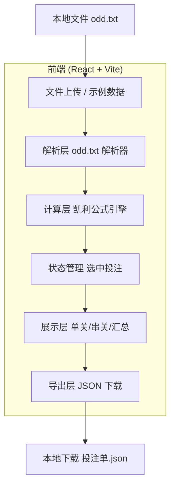

## 1. 架构设计



纯前端单页应用，无后端服务，所有计算在浏览器完成，数据不离开本地。

## 2. 技术栈

- **前端框架**：React@18 + Vite
- **样式方案**：Tailwind CSS@3
- **语言**：JavaScript（JSX）
- **初始化工具**：vite-init（react 模板）
- **后端**：无
- **数据库**：无（纯本地，文件上传/下载）

## 3. 路由定义

| 路由 | 用途 |
|------|------|
| / | 主页面，包含所有功能（资金输入、上传、计算、推荐、勾选、导出） |

## 4. 数据模型

### 4.1 输入数据模型（odd.txt）

文件由多个 JSON 对象拼接而成（非数组），每个对象结构如下：

```typescript
// 单场比赛数据
interface MatchData {
  match_info: {
    league: string;      // 联赛
    home_team: string;   // 主队
    away_team: string;   // 客队
    match_time: string;  // 比赛时间
  };
  probabilities: {
    // 胜平负：win/draw/loss 各自带 probability 与 odds
    win: number; odds: number;
    draw: number; odds: number;
    loss: number; odds: number;
  };
  top_three_scores: Array<{
    score: string;       // 如 "1-1"
    probability: number;
    odds: number;
  }>;
  top_total_goals: Array<{
    goals: number;
    probability: number;
    odds: number;
  }>;
}
```

注：原文件 `probabilities` 字段中 win/draw/loss 与 odds 平铺（JSON 重复键），解析器需兼容此结构。

### 4.2 计算结果模型

```typescript
// 单个投注选项（单关）
interface BetOption {
  id: string;                // 唯一标识
  matchId: string;           // 所属比赛
  matchLabel: string;        // "主队 vs 客队"
  category: '胜平负' | '比分' | '总进球';
  option: string;            // 如 "主胜"、"1-1"、"2球"
  probability: number;
  odds: number;
  kelly: number;             // 凯利比例
  ev: number;                // 期望价值
  suggestedAmount: number;   // 建议金额（半凯利）
}

// 串关组合
interface ParlayOption {
  id: string;
  legs: BetOption[];         // 各腿
  combinedOdds: number;      // 组合赔率
  combinedProbability: number;
  kelly: number;
  ev: number;
  suggestedAmount: number;
  label: string;             // 组合描述
}

// 导出投注行（CSV 每行结构）
interface ExportRow {
  type: '单关' | '串关';
  label: string;           // 选项描述
  odds: number;
  probability: number;
  kelly: number;
  suggestedAmount: number;
  expectedReturn: number;  // 建议金额 × 赔率
  exportedAt: string;      // 时间戳
  totalBankroll: number;
}
```

## 5. 核心计算逻辑

### 5.1 凯利公式
```
f* = (p × o - 1) / (o - 1)
EV = p × o - 1
建议金额 = (f* / 2) × 总资金   // 半凯利降风险
```

### 5.2 串关组合生成
1. 收集所有比赛的正 EV 单关选项（每场比赛最多取凯利最高的 1-2 项参与串关，避免组合爆炸）
2. 生成 2 串 1（任选两场各一项）与 3 串 1（任选三场各一项）组合
3. 计算组合凯利，仅保留 `f* > 0` 的组合
4. 按凯利比例降序排列，取前 N 个展示

## 6. 关键实现要点

- **文件解析**：odd.txt 为多个 JSON 对象拼接，需用正则或花括号匹配切分后逐个 `JSON.parse`
- **数据安全**：所有计算纯本地，不涉及网络请求
- **导出**：使用 Blob（type: 'text/csv;charset=utf-8'，前置 BOM）+ URL.createObjectURL 实现 CSV 文件下载，文件名含时间戳
- **状态管理**：React useState/useReducer 管理勾选状态，无需全局状态库
